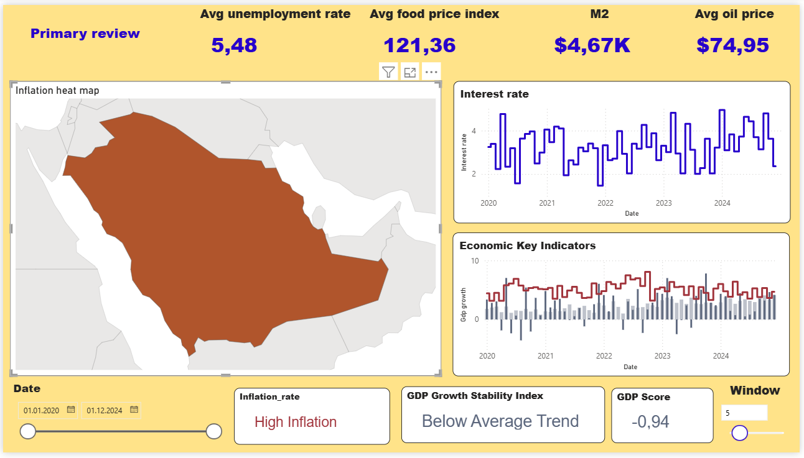
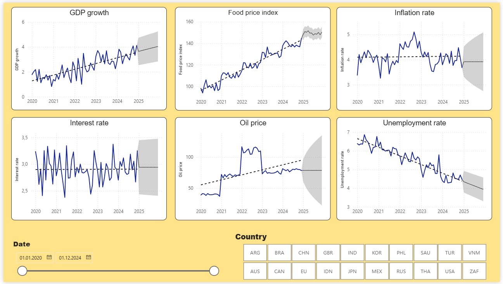
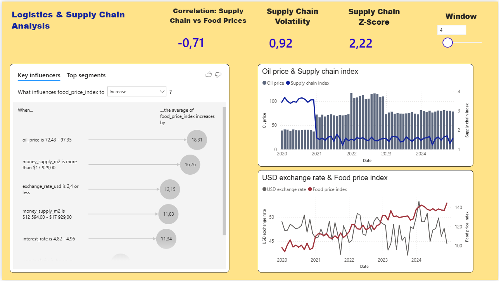
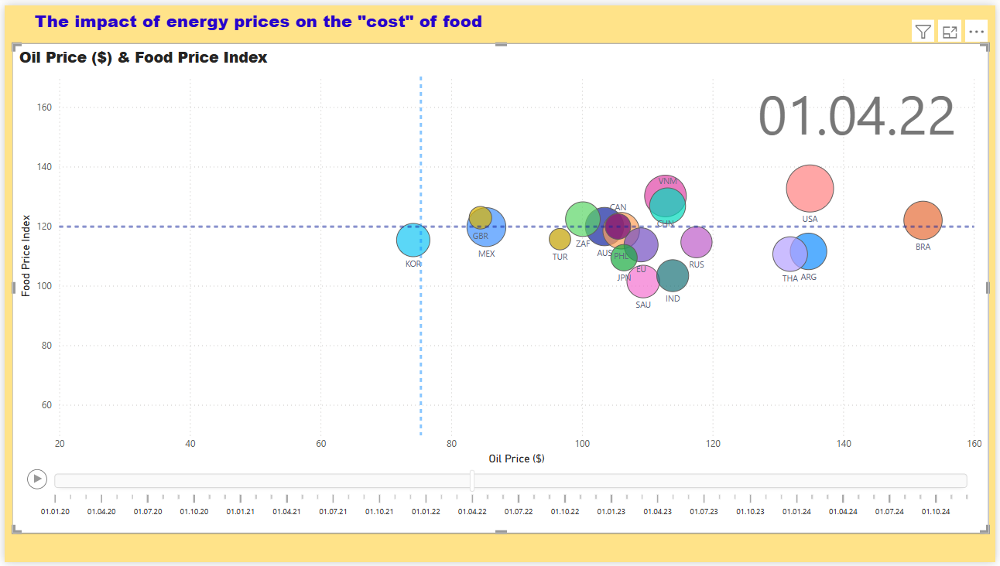

# After-covid-macroeconomics
Developing a Power BI visualization tool to identify correlations between data points and the outcomes of their interactions.

**Dataset Source:** [Global Inflation Dynamics Post-COVID (2020-2024)](https://www.kaggle.com/datasets/ssssws/global-inflation-dynamics-post-covid-20202024)

---

## Data Challenges & Processing
During the Exploratory Data Analysis (EDA), I encountered several consistency issues, particularly with the **M2 Money Supply** metrics. It was unclear if values were in local currency or USD. While an "Exchange Rate to USD" column was available, the raw values required significant transformation.

The data cleaning phase was a **"meditative"** process, focusing on:
* **Data Normalization:** Standardizing data types for seamless Power BI integration.
* **Precision Management:** Handling float precision and null values within Power Query.
* **Structural Transformation:** Converting raw economic metrics into functional analytical dimensions.

---

## Key "Anti-Insights" & Data Validation
* **Data Integrity Note:** In the raw dataset, Canada's reported Money Supply appeared larger than that of the USA. Since this indicates non-validated raw data, certain deep-dive opportunities were limited.
* **Logic Preservation:** Despite these discrepancies, the core analytical logic and the relationship-mapping framework within the dashboard remain fully functional and structurally sound.

---

## Technical Stack
* **Tool:** Power BI Desktop
* **Data Engine:** Power Query (M)
* **Visuals:** Shape Maps, Key Influencers (AI-driven), Time-series forecasting, Dynamic Bubble Charts.

---

### Page 1: Global Macroeconomic Overview
The analysis begins with a high-level view of global inflation dynamics. Using **Shape Maps**, I visualized the geographic distribution of economic indicators to identify the most impacted regions.

### Page 2: Forecasting & Trends
Next, I moved to time-series analysis to project future outlooks based on historical post-COVID volatility.

### Page 3: Logistics & Energy Impact
This section explores the correlation between supply chain disruptions and energy price fluctuations.

### Page 4: AI-Driven Insights
The final step uses the **Key Influencers** visual to mathematically determine which factors had the most significant impact on the target metrics.

---

##  Video Demonstration
For a full interactive experience, you can watch the recorded walkthroughs:
* [Part 1: UI & Global Trends](media/dashB_vid_part1.mp4)
* [Part 2: Deep Dive & AI Visuals](media/dashB_vid_part2.mp4)
